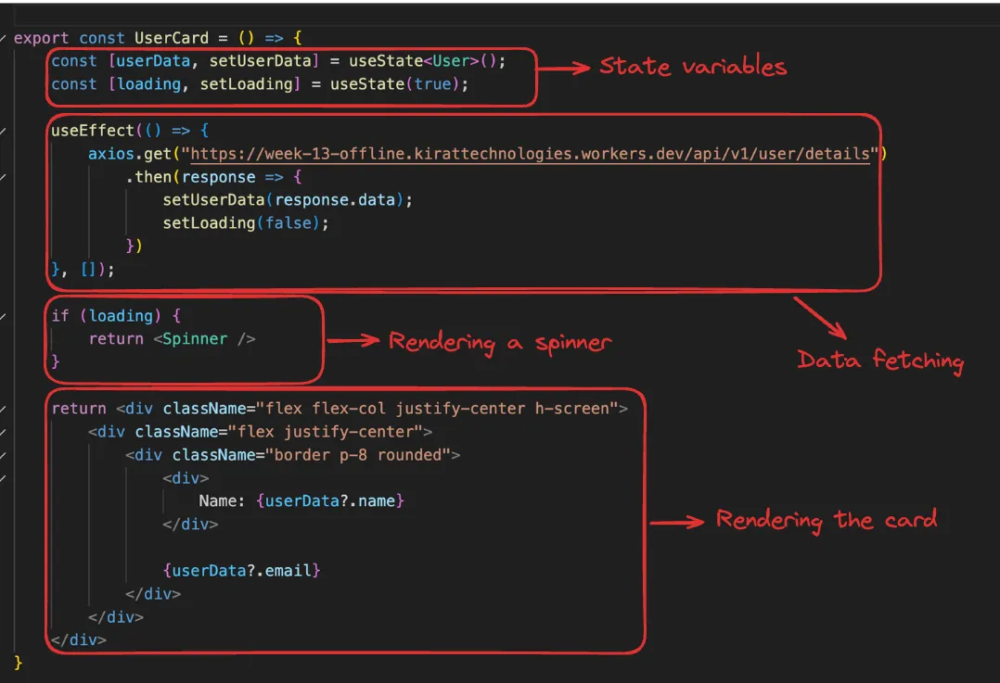
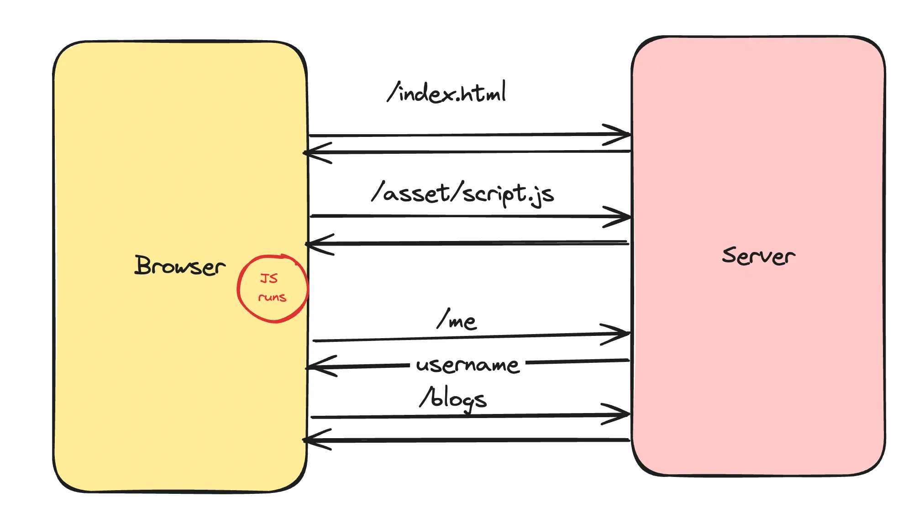

### Nextjs Backend
- Next.js is a full stack framework
- This means the same process can handle frontend and backend code.

### Why?
- Single codebase for all your codebase
- No cors issues, single domain name for your FE and BE
- Ease of deployment, deploy a single codebase

### Recap of Data fetching in React

- Example- User card website
Build a website that let’s a user see their name and email from the given endpoint.
https://week-13-offline.kirattechnologies.workers.dev/api/v1/user/details 


```
"use client"

import axios from "axios"
import { useEffect, useState } from "react"

export default function User() {
    const [loading,setLoading] = useState(true)
    const [data,setData] = useState({})
    useEffect(()=>{
        setLoading(true)
        axios.get("https://week-13-offline.kirattechnologies.workers.dev/api/v1/user/details ").then(
            (response)=>{
                
                setData(response.data)
                
            }
        )
        setLoading(false)
    },[])

    if (loading) {
        return <div>
            Loading...
        </div>
    }
  
    return (
        <div>
            User Page
            <div>
                {data?.name}     
            </div>
            <div> 
                {data?.email}
            </div>
            
        </div>
    )
}
```

- Data fetching happens on the client in React

```
import axios from "axios"

export default async function User() {
     const response = await  axios.get("https://week-13-offline.kirattechnologies.workers.dev/api/v1/user/details ")
     const data = response.data
    return (
        <div>
            User Page
            <div>
                {data?.name}     
            </div>
            <div> 
                {data?.email}
            </div>
        </div>
    )
}
```

### Loaders in Next
What if the getUserDetails call takes 5s to finish (lets say the backend is slow). You should show the user a loader during this time.

- loading.tsx file
Just like page.tsx and layout.tsx , you can define a skeleton.tsx file that will render until all the async operations finish
- Create a loading.tsx file in the root folder
- Add a custom loader inside

```
export default function Loading() {
    return <div className="flex flex-col justify-center h-screen">
        <div className="flex justify-center">
            Loading...
        </div>
    </div>
  }
```

### Introducing api routes in Next.js

NextJS lets you write backend routes, just like express does.
This is why Next is considered to be a full stack framework.

The benefits of using NextJS for backend includes - 
- Code in a single repo
- All standard things you get in a backend framework like express
- Server components can directly talk to the backend
 
### Moving the backend into our own app

We want to introduce a route that returns hardcoded values for a user’s details (email, name, id)
- Introduce a new folder called api
- Add a folder inside called user
- Add a file inside called route.ts
- Initialize a GET route inside it
```
export  function GET() {
    return NextResponse.json({
        name:"Anurag",
        email:"anurg@yahoo.com"
    })
}
```

- Try replacing the api call in page.tsx to hit this URL
```
async function getUserDetails() {
  try {
    const response = await axios.get("http://localhost:3000/api/user")
	  return response.data;
  }  catch(e) {
    console.log(e);
  }
}
```
- This isn’t the best way to fetch data from the backend. We’ll make this better as time goes by

### Full Stack ToDo App in NextJs, Prisma, Postgress
- Frontend for Signup
- Backend for Singup
- Add Prisma & Postgress DB
