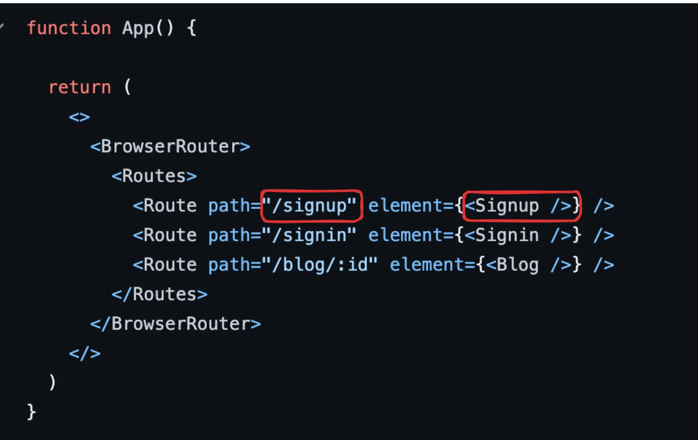
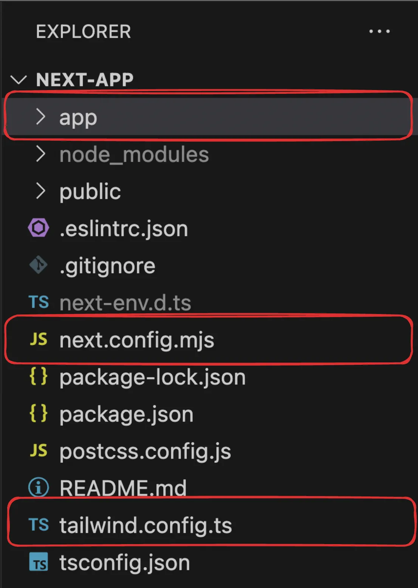
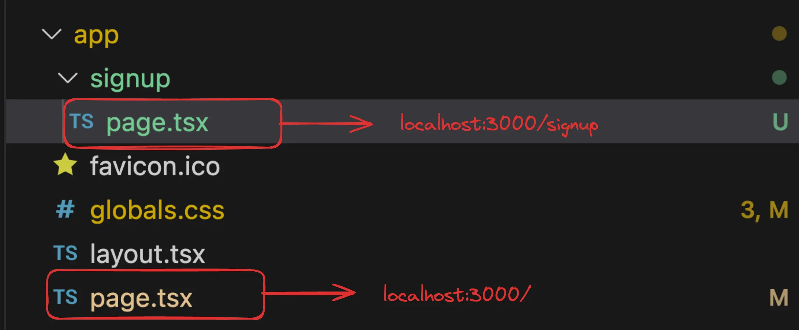

### Nextjs notes

NextJS was a framework that was introduced because of some minor inconviniences in React.

- In a React project, you have to maintain a separate Backend project for your API routes
- React does not provide out of the box routing (you have to use react-router-dom)
- React is not SEO Optimised (not exactly true today because of React Server components)
- Waterfalling problem
 
- [x] SEO Optimization
 
Google/Bing has a bunch of crawlers that hit websites and figure out what the website does. 
It ranks it on Google based on the HTML it gets back
The crawlers DONT usually run your JS and render your page to see the final output. 
While Googlebot can run JavaScript, dynamically generated content is harder for the scraper to index

- [x] Waterfalling problem
The "waterfalling problem" in React, and more broadly in web development, refers to a scenario where data fetching operations are chained or dependent on each other in a way that leads to inefficient loading behavior.


Fetching the index.html from the CDN
Fetching script.js from CDN
Checking if user is logged in (if not, redirect them to /login page)
Fetching the actual blogs
There are 4 round trips that happen one after the other (sequentially)

### What does nextjs provide you?


### Next.js provides you the following upsides over React
- Server side rendering - Get’s rid of SEO problems
- API routes - Single codebase with frontend and backend
- File based routing (no need for react-router-dom)
- Bundle size optimisations, Static site generation
- Maintained by the Vercel team

### Downsides - 
- Can’t be distributed via a CDN, always needs a server running that does server side rendering and hence is expensive
- Very opinionated, very hard to move out of it

### Bootstrappiong nextjs app
```
npx create-next-app@latest
```

### File structure
- next.config.mjs - Nextjs configuration file
- tailwind.config.js - Tailwind configuration file
- app - Contains all your code/components/layouts/routes/apis

### Bootstrap the project
- Remove everything from app/page.tsx and return an empty div
- Remove the css bits (not the tailwind headers) from the global.css file

### Understanding routing in Next

### How Routing happens in React


Next.js has a file based router (https://nextjs.org/docs/app/building-your-application/routing/defining-routes)
This means that the way you create your files, describes what renders on a route
 - Here is Next App folder structure


- Let’s add a new folder in app called signup 
- Let’s add a file called page.tsx inside app/signup
page.tsx

```
export default function Signup() {
    return (
      <div>
        hi from the signup page
      </div>
    );
  }
```
### How to call Signup Page
```
http://localhost:5173/signup
```
### Final folder structure


