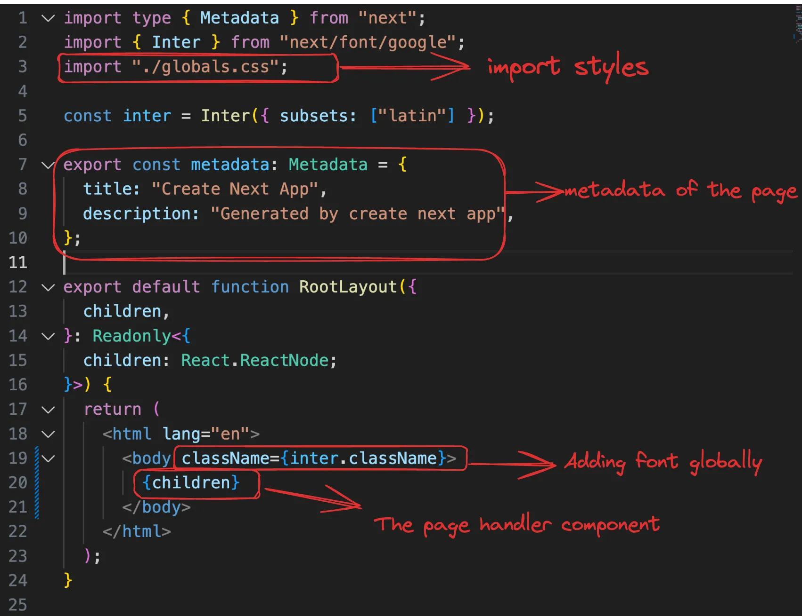
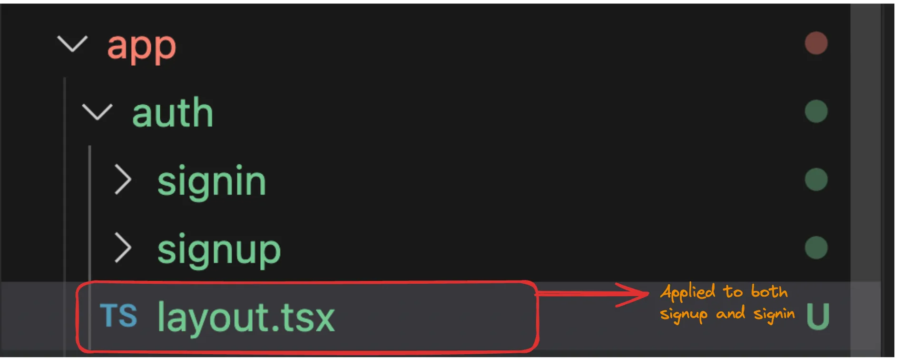
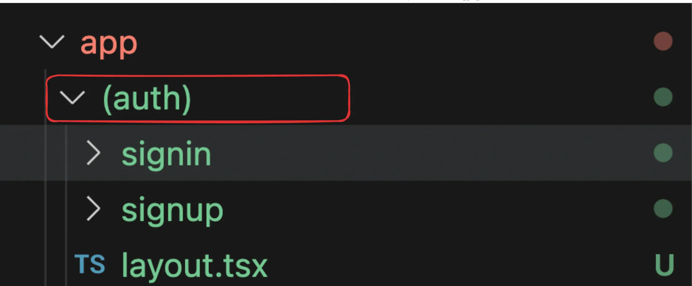

### Nextjs notes

NextJS was a framework that was introduced because of some minor inconviniences in React.

- In a React project, you have to maintain a separate Backend project for your API routes
- React does not provide out of the box routing (you have to use react-router-dom)
- React is not SEO Optimised (not exactly true today because of React Server components)
- Waterfalling problem
 
- [x] SEO Optimization
 
Google/Bing has a bunch of crawlers that hit websites and figure out what the website does. 
It ranks it on Google based on the HTML it gets back
The crawlers DONT usually run your JS and render your page to see the final output. 
While Googlebot can run JavaScript, dynamically generated content is harder for the scraper to index

- [x] Waterfalling problem
The "waterfalling problem" in React, and more broadly in web development, refers to a scenario where data fetching operations are chained or dependent on each other in a way that leads to inefficient loading behavior.


Fetching the index.html from the CDN
Fetching script.js from CDN
Checking if user is logged in (if not, redirect them to /login page)
Fetching the actual blogs
There are 4 round trips that happen one after the other (sequentially)

### What does nextjs provide you?


### Next.js provides you the following upsides over React
- Server side rendering - Get’s rid of SEO problems
- API routes - Single codebase with frontend and backend
- File based routing (no need for react-router-dom)
- Bundle size optimisations, Static site generation
- Maintained by the Vercel team

### Downsides - 
- Can’t be distributed via a CDN, always needs a server running that does server side rendering and hence is expensive
- Very opinionated, very hard to move out of it

### Bootstrappiong nextjs app
```
npx create-next-app@latest
```

### File structure
- next.config.mjs - Nextjs configuration file
- tailwind.config.js - Tailwind configuration file
- app - Contains all your code/components/layouts/routes/apis

### Bootstrap the project
- Remove everything from app/page.tsx and return an empty div
- Remove the css bits (not the tailwind headers) from the global.css file

### Understanding routing in Next

### How Routing happens in React


Next.js has a file based router (https://nextjs.org/docs/app/building-your-application/routing/defining-routes)
This means that the way you create your files, describes what renders on a route
 - Here is Next App folder structure


- Let’s add a new folder in app called signup 
- Let’s add a file called page.tsx inside app/signup
page.tsx

```
export default function Signup() {
    return (
      <div>
        hi from the signup page
      </div>
    );
  }
```
### How to call Signup Page
```
http://localhost:5173/signup
```
### Final folder structure


- Visit http://localhost:3000/signup
- Notice the response you get back in your HTML file
- Now if GoogleBot tries to scrape your page, it’ll understand that this is a signup page without running any Javascript.
- The first index.html file it get’s back will have context about the page since it was server side rendered

### Layouts in NextJs
Layouts let you wrap all child pages inside some logic.
Let’s explore layout.tsx


### Assignment
Try adding a simple Appbar- In Layout.tsx, make these changes
```
export default function RootLayout({
  children,
}: Readonly<{
  children: React.ReactNode;
}>) {
  return (
    <html lang="en">
      <body
        className={`${geistSans.variable} ${geistMono.variable} antialiased`}
      >
        {/* Changes for App Bar */}
        <div className="p-4 border-b">
          App Bar Sample
        </div>
        {children}
      </body>
    </html>
  );
}
```
### Layouts in sub routes
What if you wan’t all routes that start with /signin  to have a banner that says Login now to get 20% off


Add file layout.tsx in signin folder
```
export default function Layout({
    children,
  }: Readonly<{
    children: React.ReactNode;
  }>) {
    return (
      <html lang="en">
        <body>
          <div className="p-4 border-b">
            App Bar Sample
          </div>
          {children}
        </body>
      </html>
    );
  }
```

### Merging routes
What if you wan’t to get the banner in both signup and signin?

- Approach #1
Move both the signin and signup folder inside a auth folder where we have the layout

You can access the routes at 
http://localhost:3000/auth/signup and http://localhost:3000/auth/signin

### Approach #2
You can use create a new folder with () around the name. 
This folder is ignored by the router.

You can access the routes at 
http://localhost:3000/signup and http://localhost:3000/signin


### components directory
You should put all your components in a components directory and use them in the app routes rather than shoving everything in the route handler
 
- Create a new folder called components in the root of the project
- Add a new component there called Signin.tsx
- Move the signin logic there
- Render the Signin component in app/(auth)signin/page.tsx
 
### components/Signin.tsx
```
export function Signin() {
    return <div className="h-screen flex justify-center flex-col">
        <div className="flex justify-center">
        <a href="#" className="block max-w-sm p-6 bg-white border border-gray-200 rounded-lg shadow hover:bg-gray-100 ">
                <div>
                    <div className="px-10">
                        <div className="text-3xl font-extrabold">
                            Sign in
                        </div>
                    </div>
                    <div className="pt-2">
                        <LabelledInput label="Username" placeholder="harkirat@gmail.com" />
                        <LabelledInput label="Password" type={"password"} placeholder="123456" />
                        <button type="button" className="mt-8 w-full text-white bg-gray-800 focus:ring-4 focus:ring-gray-300 font-medium rounded-lg text-sm px-5 py-2.5 me-2 mb-2">Sign in</button>
                    </div>
                </div>
            </a>
        </div>
    </div>
}

interface LabelledInputType {
    label: string;
    placeholder: string;
    type?: string;
}

function LabelledInput({ label, placeholder, type }: LabelledInputType) {
    return <div>
        <label className="block mb-2 text-sm text-black font-semibold pt-4">{label}</label>
        <input type={type || "text"} id="first_name" className="bg-gray-50 border border-gray-300 text-gray-900 text-sm rounded-lg focus:ring-blue-500 focus:border-blue-500 block w-full p-2.5" placeholder={placeholder} required />
    </div>
}

```

### pp/(auth)/Signin.tsx
```
import { Signin as SigninComponent } from "@/components/Signin";

export default function Signin() {
    return <SigninComponent />
}
```

### Add a button onclick handler
```
<button onClick={() => {
    console.log("User clicked on signin")
}} type="button" className="mt-8 w-full text-white bg-gray-800 focus:ring-4 focus:ring-gray-300 font-medium rounded-lg text-sm px-5 py-2.5 me-2 mb-2">Sign in</button>
```
You will notice an error when you open the page

### Client and server components

NextJS expects you to identify all your components as either client or server
As the name suggests
- Server components are rendered on the server
- Client components are pre-rendered and are pushed to the client to be rendered again
- By default, all components are server components.
If you wan’t to mark a component as a client component, you need to add the following to the top of the component - 
```
"use client"
```

### When should you create client components ?
- Whenever you get an error that tells you that you need to create a client component
- Whenever you’re using something that the server doesn’t understand (useEffect, useState, onClick…)
- Rule of thumb is to defer the client as much as possible

Some Nice Readings

https://github.com/vercel/next.js/discussions/43153 