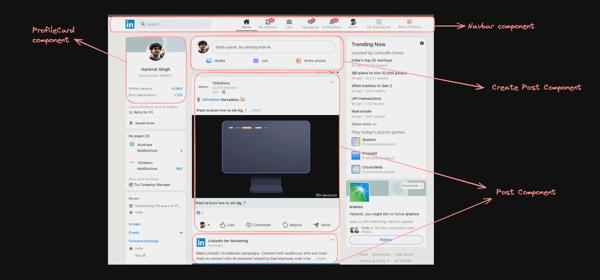

### React Notes
https://thenewstack.io/mastering-progressive-hydration-for-enhanced-web-performance/?ref=dailydev

### 1. Bootstrapping a local React Project

There are various ways to bootstrap a react project locally. Vite is the most widely used one today. 
Vite (French word for "quick", pronounced `/vit/`, like "veet") is a build tool that aims to provide a faster and leaner development experience for modern web projects. It consists of two major parts:

- A dev server that provides [**rich feature enhancements**](https://vite.dev/guide/features) over [**native ES modules**](https://developer.mozilla.org/en-US/docs/Web/JavaScript/Guide/Modules), for example extremely fast [**Hot Module Replacement (HMR)**](https://vite.dev/guide/features#hot-module-replacement).
- A build command that bundles your code with [**Rollup**](https://rollupjs.org/), pre-configured to output highly optimized static assets for production.

### HMR issue in WSL2, solution is to modify vite.config.js
```
export default defineConfig({
  plugins: [react()],
  server: {
    watch: {
      usePolling: true
    }
  }
})
```
### Intializing a react project

```
npm create vite@latest
```
### 2. Components

In React, components are the building blocks of the user interface. They allow you to split the UI into independent, reusable pieces that can be thought of as custom, self-contained HTML elements.



### 3.useState

`useState` is a Hook that lets you add state to functional components. It returns an array with the current state and a function to update it.
```
import { useState } from "react";
function App() {
  const [count,setCount] = useState(0);
  return (
   <div>
    <button onClick={()=>setCount(count+1)}
    >Pressed {count} times.</button>
   </div>
  )
}
export default App
```

### 4. Tracking re-renders

Install the react dev tools to track which components are re-rendering as your state changes

https://chromewebstore.google.com/detail/react-developer-tools/fmkadmapgofadopljbjfkapdkoienihi?pli=1